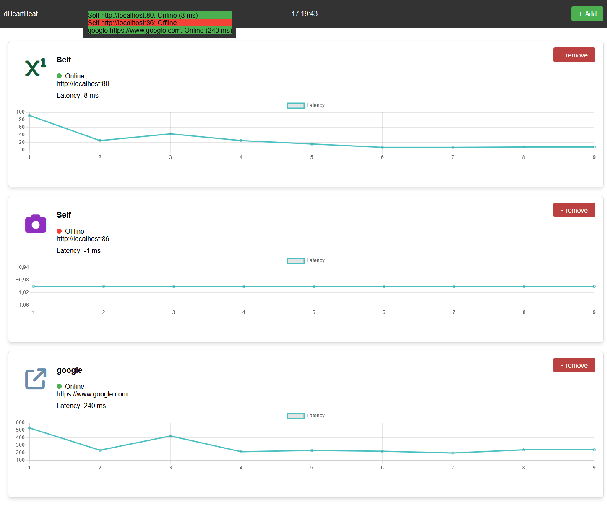
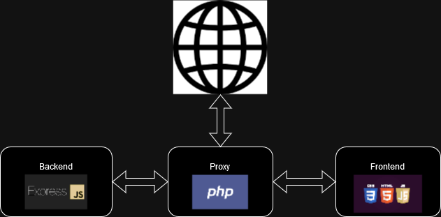

# dHeartBeat
 DockerHeartBeat (dHeartBeat) is a simplistic monitoring tool and microservice for visualizing the realtime accessability of arbitrary network IP, PORT and PATHs. The software utilizes interval heartbeat to evaluate the external system response latency. The idea behind the project was to easily keep track of massive docker orchestrations. The demo screenshot below visualizes the software in action. The application consists of a PHP proxy handling message sharing, an ExpressJS backend handling link checkups and a frontend utilizing Javascript, HTML and CSS. The application is of course dockerized and can easily be integrated in any docker environment.





# Getting started

1. Download the repository.
2. (Optional) Update startup links in `./backend/links.txt`.
3. Start application by running ```docker-compose up -d```


This will expose the WebGUI at http://localhost:8085.

# Additional Features

* **Toast notifications** - Important events are amplified to user via toast notifications.
* **Load .txt files of links** - Multiple links can be added to the heartbeat backend by parsing .txt files.
* **Random icon generation** - In order to create idiosyncrasies in the GUI icons are random selected for each object in the listview.
* **Draggable status P-i-P window** - To get a better overview of all heartbeats, there is a movable status box in the UI.


# System sketch

dHeartBeat utilizes a PHP-proxy to handle external aswell as internal requests. The system sketch below presents the very simplistic system architecture. The frontend acts as a controller of backend activities. The backend handles all heartbeat connections and calculations, this way the impact on network resources is reduced. The proxies task is mainly to make sure all messages can travel even without CORS and other headers so that `https` domains aswell as `http` can be monitored.



# External Libraries

In this repository i have copied the `Toastify`, `ChartsJS` and `awesome fonts` libraries into the external folder in order to run this offline!

# License

This repository is created using [MIT LICENSE](./LICENSE)

# Issues

Let me know if there are any questions or issues. 


@ Grebtsew 2024