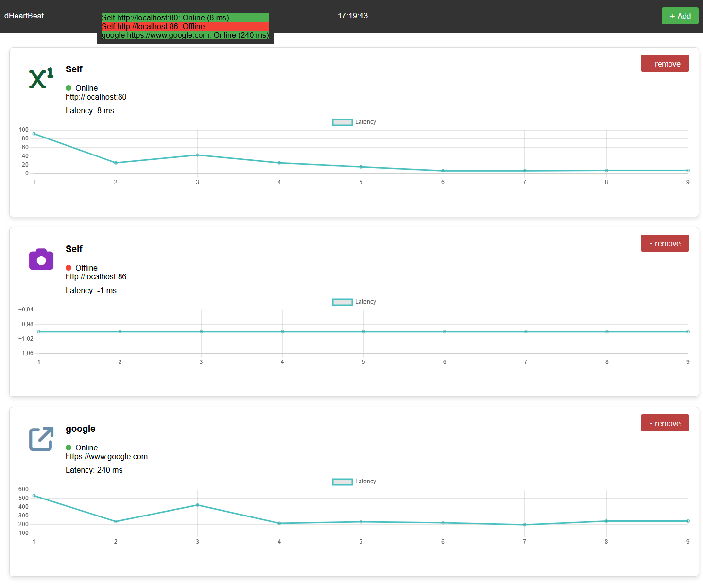

# dHeartBeat
 Docker Heart Beat (dHeartbeat) is a simple monitoring tool and microservice for checking heartbeats on custom url links. The software uses interval heartbeat to evaluate any software IP, PORT and PATH state. The idea is to easily keep track of massive docker setups. The demo screenshot below visualizes the software in action. The software consists of a PHP proxy handling message sharing, an Express backend handling link checkups and a frontend. The application is of course dockerized.





# Getting started

Download the repository, update links in `./links.txt` and run ```docker-compose up -d```
This will expose the WebGUI at http://localhost:8085.

# Additional Features

* Toast notifications
* Load .txt files of links
* Random icon generation

# Libraries

In this repository i have copied the `Toastify`, `ChartsJS` and `awesome fonts` libraries in order to run this offline!

# License

This repository is created using [MIT LICENSE](./LICENSE)

# Issues

Let me know if there are any questions or issues. 


@ Grebtsew 2024